# 📘 Guía de Integración Figma ↔️ Shadcn UI & Tailwind v4
## Vanguard Botics: Smart Parking System

Esta guía está diseñada para que los desarrolladores y diseñadores de **Vanguard Botics** puedan colaborar sin fricciones. Explica cómo traducir los mockups de **Figma** a código funcional usando **Shadcn UI** y las nuevas directivas de **Tailwind CSS v4**.

---

## 🎨 1. Sistema de Diseño & Tokens de Color

Hemos diseñado una paleta de colores moderna de "alta tecnología" (Cyber-Tech / Slate & Neon) ideal para una aplicación de cochera inteligente en tiempo real. 

### Sincronización de Variables de Figma a CSS
En Figma, debes estructurar tus variables en dos colecciones principales: **Semánticos (Light/Dark)** y **Primitivos (Escala de color completa)**. A continuación se detalla cómo se asignan estas variables a las propiedades personalizadas de CSS en el proyecto:

| Variable en Figma | Variable CSS en Proyecto | Uso en Componentes Shadcn | Ejemplo de Color (Dark Mode) |
| :--- | :--- | :--- | :--- |
| `color/background` | `--background` | Fondo principal de la aplicación | Deep Navy/Slate (`#0f172a` o `#0a0b10`) |
| `color/foreground` | `--foreground` | Texto principal de la app | Slate White (`#f8fafc`) |
| `color/primary` | `--primary` | Botones principales, acentos de marca | Neon Blue/Cyan (`#3b82f6` o `#00d2ff`) |
| `color/primary-foreground` | `--primary-foreground` | Texto sobre botones principales | Blanco Puro (`#ffffff`) |
| `color/card` | `--card` | Fondos de tarjetas y contenedores | Sleek Dark Gray (`#1e293b` con opacidad) |
| `color/border` | `--border` | Bordes finos de separadores y cards | Slate Gray (`#334155`) |
| `color/success` | `--chart-2` o personalizado | Estado "Disponible", "Pagado" | Emerald Green (`#10b981`) |
| `color/warning` | `--chart-3` o personalizado | Estado "Excedido", "Pendiente" | Amber Yellow (`#f59e0b`) |
| `color/danger` | `--destructive` | Estado "No Pagado", "Alerta" | Crimson Red (`#ef4444`) |

---

## 🛠️ 2. Guía de Exportación de Tokens desde Figma

Para evitar configurar estilos manualmente en el código, recomendamos automatizar el flujo usando plugins de Figma:

### Plugin Recomendado 1: **Variables2CSS** o **Tokens Studio for Figma**
1. Abre tu archivo de diseño en Figma.
2. Abre el plugin **Variables2CSS** o selecciona la herramienta nativa de Variables en Figma.
3. Exporta las variables del modo Light y Dark en formato JSON o CSS.
4. Si exportas en CSS, copia las variables directamente en `:root` y `.dark` de tu archivo [index.css](file:///d:/Vanguard-Botics-main/Vanguard-Botics-main/Proyecto/src/index.css).

### Estructura de index.css para Tailwind v4
Tailwind v4 compila variables CSS automáticamente. Si defines un color `--primary`, Tailwind crea automáticamente la clase `bg-primary` y `text-primary`. 

```css
/* Ejemplo de cómo definir nuevos colores de Figma en index.css */
@theme inline {
  --color-brand-cyan: #00f0ff;
  --color-brand-neon: #a855f7;
  
  /* Esto habilita las clases bg-brand-cyan, text-brand-neon, etc. */
}
```

---

## 🧩 3. Mapeo de Símbolos de Figma a Componentes Shadcn

Al inspeccionar un diseño en Figma, identifica el patrón de UI y utiliza el componente Shadcn correspondiente en lugar de programarlo desde cero:

```mermaid
graph TD
    A[Mockup en Figma] --> B[Identificar Elemento]
    B -->|Boton/Accion| C[<Button />]
    B -->|Tarjeta/Info de Auto| D[<Card />]
    B -->|Lista/Historial de Pagos| E[<Table />]
    B -->|Estado: Libre/Ocupado| F[<Badge />]
    B -->|Confirmacion de Cobro| G[<Dialog />]
    B -->|Selector de Tarifa| H[<Select />]
    B -->|Menu de Perfil| I[<DropdownMenu />]
```



### Tabla de Referencia Rápida:

| Elemento Figma | Componente Shadcn a importar | Comando para agregar (si falta) |
| :--- | :--- | :--- |
| **Buttons & Action Links** | `Button` | `npm run ui:add button` |
| **Info Box / Dashboard Widgets** | `Card`, `CardHeader`, `CardContent` | `npm run ui:add card` |
| **Status Tag / Role Label** | `Badge` | `npm run ui:add badge` |
| **Form Inputs & Search Bars** | `Input`, `Label` | `npm run ui:add input label` |
| **Modal Overlays & Popups** | `Dialog`, `DialogContent` | `npm run ui:add dialog` |
| **Custom Select dropdowns** | `Select`, `SelectTrigger`, `SelectValue` | `npm run ui:add select` |
| **Navbar Profile Trigger** | `DropdownMenu`, `Avatar` | `npm run ui:add dropdown-menu avatar` |
| **Responsive Data Lists** | `Table`, `TableHeader`, `TableRow` | `npm run ui:add table` |

---

## ✨ 4. Utilidades Premium Listas para Usar

Hemos preparado estilos listos para usar en tus clases de React que elevarán la estética visual para que luzca súper premium:

### A. Efecto de Cristal (Glassmorphism)
Úsalo en cards y modales sobre fondos oscuros o degradados animados:
```tsx
// className para efecto de vidrio premium
className="bg-card/70 backdrop-blur-md border border-border/50 shadow-xl shadow-black/10"
```

### B. Acento de Neon Pulsante (para luces/estados en tiempo real)
Ideal para indicar que una cochera está disponible o que hay una sesión de estacionamiento activa:
```tsx
// className para estado activo vibrante
className="w-2.5 h-2.5 rounded-full bg-emerald-500 animate-pulse shadow-[0_0_8px_rgba(16,185,129,0.7)]"
```

### C. Contenedores de Patentes de Autos (Matrícula)
Formato de placa de vehículo estilizado que coincide con los requerimientos técnicos:
```tsx
className="inline-flex items-center gap-4 bg-primary/10 border border-primary/20 rounded-2xl px-6 py-3 font-mono font-black tracking-widest text-primary text-3xl shadow-inner shadow-primary/5"
```

---

## 🚀 5. Hoja de Trucos de Comandos Shadcn UI (Vanguard Botics)

Para agregar nuevos componentes visuales de Shadcn que no estén pre-instalados, ve a la carpeta `Proyecto` y ejecuta el comando de atajo:

```bash
# Agregar un componente individualmente
npm run ui:add <nombre-componente>

# Ejemplo
npm run ui:add dialog
```

*¡Todo listo! Tus diseños de Figma ahora tienen un canal directo y ordenado hacia el código.*
